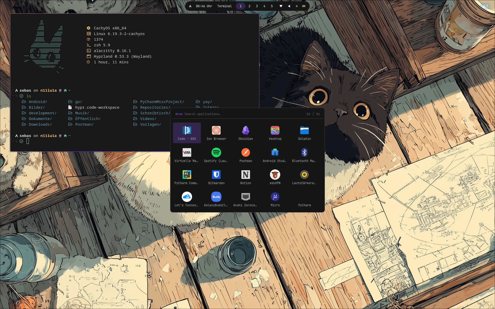

# Cachyos+Hyprland configurations

*just some .dotfiles of my system*

 

> [!note]
> This and will always be a work in progess projekt as this is from my main work system. I will not accept any PR's but may take a look at the content and may adapt my system.
> 
> Feel free to use my configs and tailor them to your neeeds.

 

##  **Content** - What in for the show?

*...*

## **Showcase**

*Imagine a gif here showing off the configs in action*

## **Programms** - What did I use ?

**Core**
- hyprland - window manager (scrolling)
- rofi - application launcher
- dunst - notification deamon
- waybar - simple, modular status bar
- zsh - shell environment

**Utilities**
- fastfetch
- starship
- yazi

**DIY** *Scripts n' Stuff*
- waybar systemd deamon - handles auto start and restart  

## **Todo list** - What is missing ?

- [ ] Genralized theming
  - [ ] GTK theming
  - [ ] Wallapper switcher
    - [ ] Theme changes based on wallpaper
  - [ ] Theme switcher